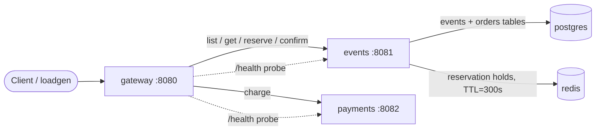

# Lab 1 — SRE Philosophy: Deploy, Break, Understand

**Author:** jakefish18
**System:** QuickTicket (gateway + events + payments + postgres + redis)
**Deployed with:** Docker Compose (Compose v5.1.0, Docker Engine 29.2.1)

> Note on ports: host port `5432` was already occupied on my machine by an
> unrelated project, so QuickTicket's Postgres is published on `5434:5432`
> (via a local compose override). Postgres is only reached over the internal
> Docker network (`DB_HOST=postgres`), so this has no effect on the app — only
> on the host-side publish port shown in `docker compose ps`.
---

## Task 1 — Deploy & Break QuickTicket

### 1) `docker compose ps` — all 5 services running

```
NAME             IMAGE                SERVICE    STATUS                    PORTS
app-events-1     app-events           events     Up 8 minutes              0.0.0.0:8081->8081/tcp
app-gateway-1    app-gateway          gateway    Up 8 minutes              0.0.0.0:3080->8080/tcp
app-payments-1   app-payments         payments   Up About a minute         0.0.0.0:8082->8082/tcp
app-postgres-1   postgres:17-alpine   postgres   Up 12 minutes (healthy)   0.0.0.0:5434->5432/tcp
app-redis-1      redis:7-alpine       redis      Up 12 minutes (healthy)   0.0.0.0:6379->6379/tcp
```

All five containers (`gateway`, `events`, `payments`, `postgres`, `redis`) are up;
Postgres and Redis report `(healthy)` from their compose healthchecks.

### 2) Full critical path (list → reserve → pay) with real data

**`GET /events`**

```json
[
    {"id": 1, "name": "Go Conference 2026",   "venue": "Main Hall A",  "date": "2026-09-15T09:00:00+00:00", "total_tickets": 100, "price_cents": 5000,  "available": 100},
    {"id": 4, "name": "Python Workshop",      "venue": "Lab 301",      "date": "2026-09-22T14:00:00+00:00", "total_tickets": 25,  "price_cents": 2000,  "available": 25},
    {"id": 2, "name": "SRE Meetup",           "venue": "Room 204",     "date": "2026-10-01T18:00:00+00:00", "total_tickets": 30,  "price_cents": 0,     "available": 30},
    {"id": 5, "name": "Kubernetes Deep Dive", "venue": "Auditorium B", "date": "2026-10-10T10:00:00+00:00", "total_tickets": 80,  "price_cents": 8000,  "available": 80},
    {"id": 3, "name": "Cloud Native Summit",  "venue": "Expo Center",  "date": "2026-11-20T10:00:00+00:00", "total_tickets": 500, "price_cents": 15000, "available": 500}
]
```

**`POST /events/1/reserve` `{"quantity": 1}`**

```json
{
    "reservation_id": "7fe2ecfd-9a33-44f7-9244-8668af94e61c",
    "event_id": 1,
    "quantity": 1,
    "total_cents": 5000,
    "expires_in_seconds": 300
}
```

**`POST /reserve/7fe2ecfd-9a33-44f7-9244-8668af94e61c/pay`**

```json
{
    "order_id": "7fe2ecfd-9a33-44f7-9244-8668af94e61c",
    "event_id": 1,
    "quantity": 1,
    "total_cents": 5000,
    "status": "confirmed"
}
```

### 3) `GET /health` when everything is healthy

```json
{
    "status": "healthy",
    "checks": {
        "events": "ok",
        "payments": "ok",
        "circuit_payments": "CLOSED"
    }
}
```

### 4) Dependency map



Text form:

```
client  → gateway
gateway → events  → postgres   (event catalog + confirmed orders)
gateway → events  → redis      (held reservations, 5-min TTL)
gateway → payments             (charge; leaf, no deps)
gateway → (health) → events, payments
```

**What depends on what / what happens if a dependency is down**

- `payments` is a **leaf** with no dependencies of its own.
- `events` has a **hard** dependency on `postgres` (every endpoint runs SQL) and an
  effectively-hard dependency on `redis` (reserve writes the hold to Redis; confirm
  reads it back).
- `gateway` is the **single front door**: every user request fans out to `events`
  and/or `payments`. It owns all the user-facing error mapping, so the error a user
  sees depends on *which gateway except-branch* catches the downstream failure.
- The full purchase flow (`/pay`) is a **distributed write across two services**:
  `payments.charge` then `events.confirm`. If the charge succeeds but the confirm
  fails, money is taken with no ticket issued (see failure table).

### 5) Failure table

Behavior below is the **baseline** (before the Task 2 change). For each component I
killed it with `docker compose stop`, exercised all four endpoints, then restarted it.
`✅` = works, `❌` = fails.

| Component Killed | Events List | Reserve | Pay | Health Check | User Impact |
|-----------------|-------------|---------|-----|--------------|-------------|
| **payments** | ✅ `200` | ✅ `200` | ❌ `502` `{"detail":"Payment service unavailable"}` | 🔴 `503` `payments: down` | Browse + reserve work; **checkout fails with an opaque 502.** Reservation stays held in Redis, so a retry would succeed once payments returns. |
| **events** | ❌ `502` `{"detail":"Events service unavailable"}` | ❌ `502` | ❌ `500` `{"detail":"Payment succeeded but confirmation failed — contact support"}` | 🔴 `503` `events: down` | **Catalog + reserve fully down.** Worst case: an in-flight pay **charges the card but cannot confirm the order** → money taken, no ticket. |
| **redis** | ✅ `200` | ❌ `504` `{"detail":"Events service timeout"}` | ❌ `500` confirm failed | 🔴 `503` `events: down` | Can still browse (reads come from Postgres, `held` defaults to 0). **Reserve hangs until the gateway 5 s timeout → 504.** Pay charges then fails to confirm (the hold can't be read back). |
| **postgres** | ❌ `502` | ❌ `500` `Internal Server Error` (raw) | ❌ `500` confirm failed | 🔴 `503` `events: degraded` | Catalog + reserve dead. **Inconsistent errors** for the same root cause: list → `502`, reserve → raw uncaught `500`. Pay charges then fails to confirm. |

**Answers to the 1.4 questions**

1. **Which endpoints still work?** Killing `payments` leaves the entire read/reserve
   path healthy. Killing `redis` leaves only reads (`/events`) working. Killing
   `events` or `postgres` takes down everything except `payments` itself.
2. **Which fail?** See table. Note `payments` down only breaks `/pay`; `events`/`postgres`
   down breaks everything.
3. **What error does the user see?** It is decided by the gateway's except-branch, and
   it is **not consistent**: connection-refused → `502`; gateway timeout → `504`;
   an unhandled downstream `500` can leak through as raw `500 Internal Server Error`
   (Postgres-down reserve). The most dangerous one is the **`500` "Payment succeeded
   but confirmation failed"** — a partial-failure / dual-write hole.
4. **Does the health endpoint reflect it?** **Always returns `503`**, so it always
   signals "something is wrong." But the granularity differs: it names `payments` and
   `events` **directly**, while `redis` and `postgres` failures only show up
   **indirectly**, rolled up under `events` being `down`/`degraded`. Interesting
   nuance: Redis-down surfaces as `events: down` (the gateway's probe to `events/health`
   itself times out, because checking Redis blocks), whereas Postgres-down surfaces as
   `events: degraded` (`events/health` returns a fast `503` because the Postgres check
   fails immediately while Redis is fine).

**Why does reserve still work after killing `payments`?** Because `reserve` only talks
to `events` (→ Postgres + Redis); the gateway does not touch `payments` until `/pay`.
Payments is off the reserve path entirely, so reserving a ticket is fully decoupled
from the ability to charge for it.

### 6) Load generator — error-rate spike when payments is killed

**Run A — baseline, all healthy (`./app/loadgen/run.sh 5 30`):**

```
QuickTicket Load Generator
Target: http://localhost:3080 | RPS: 5 | Duration: 30s
---
[10s] requests=43 success=43 fail=0 error_rate=0%
[20s] requests=86 success=86 fail=0 error_rate=0%
---
Done. total=124 success=124 fail=0 error_rate=0%
```

**Run B — kill `payments` mid-run (`run.sh 5 45`, `docker compose stop payments` at ~t=13s):**

```
QuickTicket Load Generator
Target: http://localhost:3080 | RPS: 5 | Duration: 45s
---
[10s] requests=46 success=46 fail=0  error_rate=0%
>>> [t~13s] docker compose stop payments  <<<
[20s] requests=88 success=87 fail=1  error_rate=1.1%
[30s] requests=131 success=121 fail=10 error_rate=7.6%
[40s] requests=173 success=161 fail=12 error_rate=6.9%
---
Done. total=189 success=175 fail=14 error_rate=7.4%
```

**Observation:** error rate jumps from a steady **0% → ~7.4%** the moment `payments`
dies. The spike is ~7% rather than 100% because only the **full purchase flow** (~10% of
generated traffic) touches `payments`; the 70% reads and 20% reserves keep succeeding.
This is *partial* blast radius — exactly what the dependency map predicts.

---

## Task 2 — Graceful Degradation

### Diff (`git diff app/gateway/main.py`)

```diff
diff --git a/app/gateway/main.py b/app/gateway/main.py
index c86db33..63b2de7 100644
--- a/app/gateway/main.py
+++ b/app/gateway/main.py
@@ -332,6 +332,19 @@ async def pay_reservation(reservation_id: str):
     except CircuitOpenError:
         log.error("circuit open, skipping payments call")
         raise HTTPException(503, "Payment service temporarily unavailable (circuit open)")
+    except httpx.ConnectError:
+        # Payments is unreachable (service down). Degrade gracefully instead of a
+        # generic 502: the reservation is still held in Redis, so tell the user it
+        # is safe to retry rather than failing the request hard.
+        log.warning(f"payments unreachable — degrading gracefully, reservation held: {reservation_id}")
+        return JSONResponse(
+            status_code=503,
+            content={
+                "error": "payments_unavailable",
+                "message": "Payment service is temporarily down. Your reservation is held — try again in a few minutes.",
+                "reservation_id": reservation_id,
+            },
+        )
     except httpx.TimeoutException:
         raise HTTPException(504, "Payment service timeout")
     except httpx.HTTPStatusError as e:
```

The new branch is placed **before** the generic `except Exception` (which previously
caught the connection error and returned the opaque `502`). `httpx.ConnectError` is the
specific exception raised when `payments` is unreachable; `TimeoutException` and
`HTTPStatusError` remain handled separately, so a *slow* or *erroring* payments service
still maps to `504`/the upstream status — only an *unreachable* one degrades to `503`.

### Verification (payments stopped)

**Reserve still works (`200`):**

```
$ curl -s -X POST http://localhost:3080/events/1/reserve -H 'Content-Type: application/json' -d '{"quantity":1}'
{"reservation_id":"74659df7-5faa-4cd2-a15e-3b6a9b950bb7","event_id":1,"quantity":1,"total_cents":5000,"expires_in_seconds":300}
HTTP 200
```

**Pay returns a clear, actionable `503` (not a generic 502):**

```
$ curl -s -X POST http://localhost:3080/reserve/74659df7-5faa-4cd2-a15e-3b6a9b950bb7/pay
{"error":"payments_unavailable","message":"Payment service is temporarily down. Your reservation is held — try again in a few minutes.","reservation_id":"74659df7-5faa-4cd2-a15e-3b6a9b950bb7"}
HTTP 503
```

`/events`, `/events/{id}` and `/events/{id}/reserve` are unchanged and keep working
when payments is down (they never call payments). Only `/pay` changed.

---

## Task 3 — GitHub Community

**Why starring repositories matters in open source.** A star is a lightweight,
public signal of value: it bookmarks a project so you can find it again, and in
aggregate it acts as a trust/popularity metric that helps others discover the project
and encourages maintainers to keep investing in it. Starring `inno-devops-labs/SRE-Intro`
and `simple-container-com/api` both records my interest on my profile and feeds the
projects' visibility.

**How following developers helps in team projects and professional growth.** Following
my professor, TAs, and classmates turns GitHub into a live feed of what the people
around me are building — I see their new repos, releases, and activity, which makes it
easier to learn from their work, find collaborators, review each other's code, and stay
in sync on shared coursework. Over time those connections compound into a professional
network that outlasts the class.

_Community actions performed: see the PR description checklist for the status of the
stars/follows on my account._

---

## Bonus Task — Resource Usage Under Load

`docker stats --no-stream` scoped to the five QuickTicket containers.

### B.1 — Idle (no traffic)

```
NAME             CPU %     MEM USAGE / LIMIT     NET I/O           PIDS
app-gateway-1    0.38%     38.21MiB / 7.652GiB   9.59kB / 8.93kB   2
app-events-1     0.30%     40.84MiB / 7.652GiB   10kB / 10kB       2
app-payments-1   0.26%     33.02MiB / 7.652GiB   1.06kB / 264B     1
app-postgres-1   1.25%     23.71MiB / 7.652GiB   236kB / 271kB     8
app-redis-1      0.74%     11.01MiB / 7.652GiB   70.2kB / 28.5kB   7
```

### B.2 — Under load (`run.sh 10 30`, snapshot at steady state)

```
NAME             CPU %     MEM USAGE / LIMIT     NET I/O           PIDS
app-gateway-1    3.93%     38.54MiB / 7.652GiB   167kB / 162kB     2
app-events-1     2.43%     41.17MiB / 7.652GiB   142kB / 191kB     2
app-payments-1   0.34%     33.73MiB / 7.652GiB   5.46kB / 3.38kB   2
app-postgres-1   1.09%     23.91MiB / 7.652GiB   309kB / 360kB     8
app-redis-1      0.57%     11.03MiB / 7.652GiB   86.1kB / 35.5kB   7
```
_loadgen: `total=223 success=223 fail=0 error_rate=0%`_

### B.3 — Chaos (`PAYMENT_FAILURE_RATE=0.3 PAYMENT_LATENCY_MS=500`, `run.sh 10 30`)

```
NAME             CPU %     MEM USAGE / LIMIT     NET I/O           PIDS
app-gateway-1    2.05%     38.67MiB / 7.652GiB   459kB / 449kB     2
app-events-1     2.10%     41.28MiB / 7.652GiB   406kB / 549kB     2
app-payments-1   0.19%     34.97MiB / 7.652GiB   4.99kB / 3.55kB   2
app-postgres-1   0.17%     23.87MiB / 7.652GiB   450kB / 524kB     8
app-redis-1      0.63%     11.03MiB / 7.652GiB   126kB / 51.7kB    7
```
_loadgen: `total=160 success=155 fail=5 error_rate=3.1%`_

### Analysis

- **Which service uses the most memory? Does it change under load?**
  `events` is the heaviest at ~**41 MiB**, just above `gateway` (~38 MiB) — both are
  Python/FastAPI processes, and `events` additionally holds a Postgres connection pool
  (2–10 conns) plus a Redis client. Memory is **essentially flat** across idle → load →
  chaos (≤ ~1 MiB drift): footprint is dominated by the Python runtime + libraries, not
  by request volume. `redis` is the lightest (~11 MiB).

- **Which service uses the most CPU under load? Why?**
  `gateway` (3.93%), then `events` (2.43%). The gateway is the **single front door** —
  it terminates *every* client request, runs metrics middleware, normalizes paths, and
  fans out to downstream services, so it does work on both the inbound and the outbound
  side of each request. `events` only does work for the read/reserve subset; `payments`
  stays near-idle (it mostly sleeps/returns a stub).

- **How does fault injection in payments affect gateway resources?**
  With 500 ms of injected latency, the gateway's CPU actually **drops** (3.93% → 2.05%)
  while completed throughput falls from **223 → 160** requests in the same 30 s. The
  gateway isn't doing *less work per request* — it's spending that time **blocked,
  holding the connection open** waiting on slow payments (I/O wait, not CPU). So slow
  payments converts a CPU-bound throughput profile into a **connection-holding / latency
  bound** one: fewer requests finish, sockets stay open longer (note gateway NET I/O is
  higher), and under real concurrency this is exactly how a slow dependency exhausts the
  caller's connection pool and propagates the outage upstream.

---

## Summary of artifacts

- All 5 services deployed and verified (critical path + health).
- Full failure table for `payments`, `events`, `redis`, `postgres` with observed
  status codes and user impact, including the **charge-without-confirm** partial-failure
  hole and the **inconsistent gateway error mapping**.
- Load generator shows the **0% → 7.4%** error spike when `payments` is killed mid-run.
- Task 2: gateway now degrades a payments outage to an actionable **503** while keeping
  reserve fully functional.
- Bonus: idle/load/chaos resource tables + analysis of the CPU→latency-bound shift.